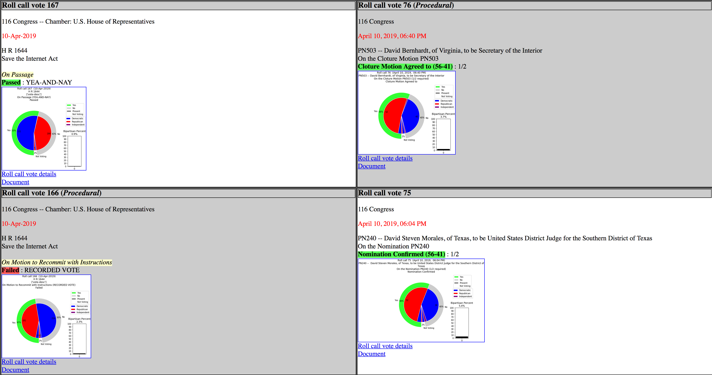
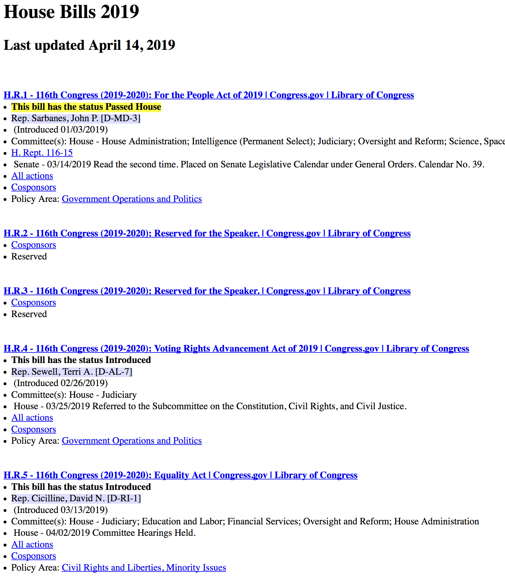
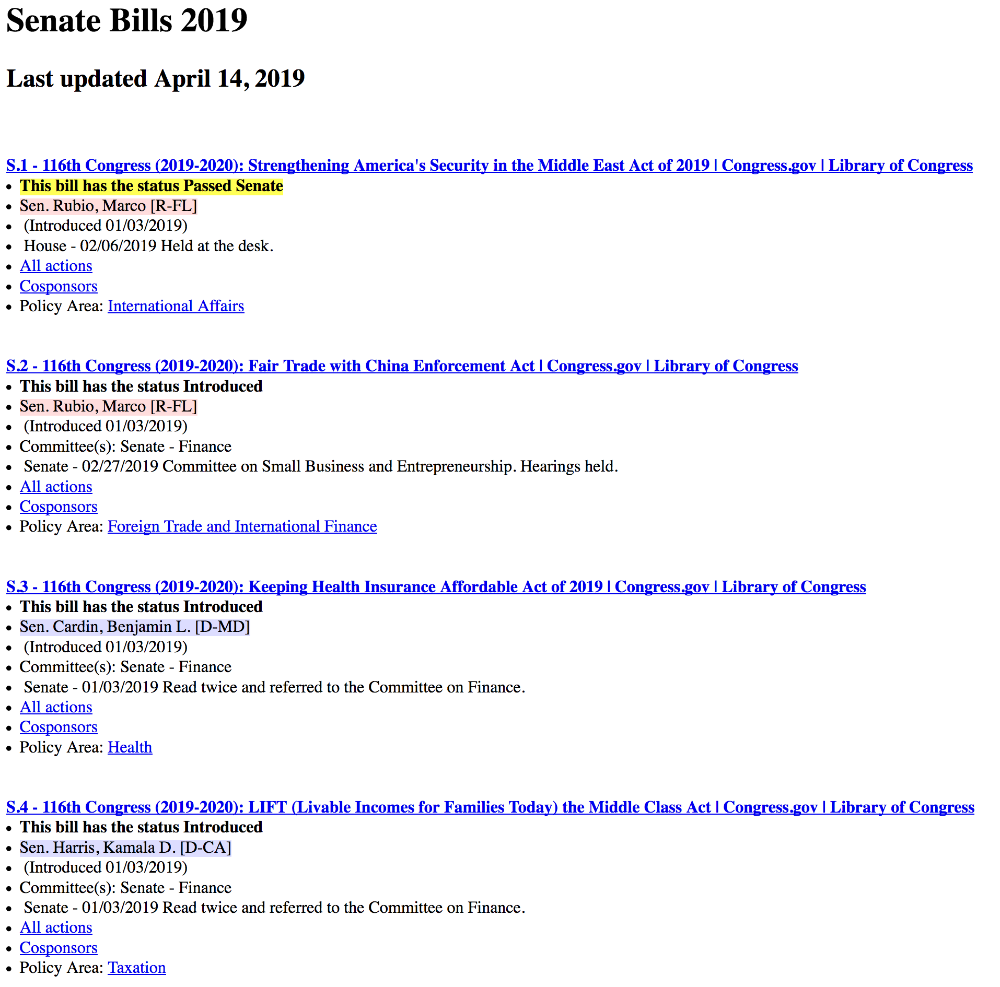
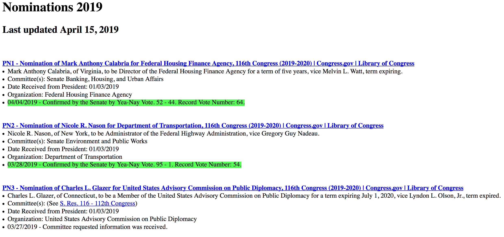
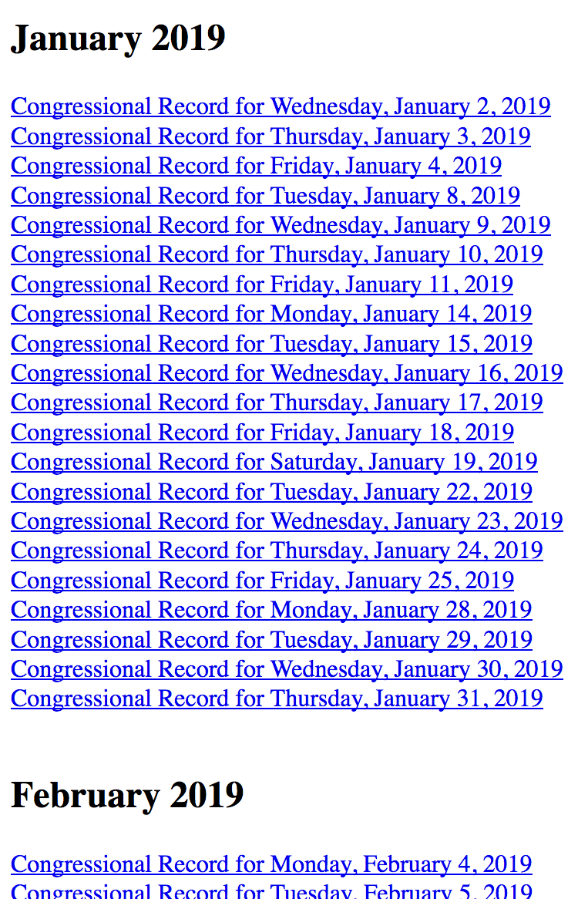

# gov_data
This project collects the voting records of the US Congress (both chambers) and creates graphs showing the vote results overall and by party.

collect_congress_votes.py cycles through the available vote record pages on congress.gov, converts the XML files found to a JSON format, and saves the results to a local subdirectory. The process is repeated for the senate.gov vote record pages available.

process_congress_votes.py reads the saved JSON files from the House and Senate subdirectories, creates PNG images of nested pie charts showing the vote records in graph form, and creates an HTML file to display the graphs ordered from most recent to earliest vote for the current congress.

Both files have an UPDATES_ONLY flag which can be left True to only process vote record pages which are newer than the most recent processing cycle, or missing. Or the UPDATES_ONLY flag can be set False to force reprocessing of all vote pages for the collect process or all images for the process votes procedure.

An excerpt of the result of the vote collection and processing is shown below. The diagrams are hyperlinked to full sized images for detail. They show the percentage of total votes (yes/no/not-voting) on the outer ring, and the number of party members for the chamber voting yes or no or not voting on the inner ring.
Links are created to the roll call pages and document pages on congress.gov to allow the viewer to dig in deeper at will.
Pass and Fail votes are highlighted in green or red respectively for a quick view. Procedural votes have the cells grayed out slightly, along with having a title indicating the vote type.

A recent addition has been a set of functions to gather all available House and Senate bills and resolutions, and Senate nominations, and creating HTML pages to list each set. Each bill, resolution, or nomination has a title hyperlinked to the congress.gov webpage for further reading,
and each listed item shows the sponsor who introduced the bill (highlighted blue for Democrat, red for republican) as well as showing the policy area (linked to the bill's page of legislative subjects), cosponsors listing page, and other specific points of interest for the bill (such as the full list of actions regarding the bill so far).

And the latest addition is a procedure to collect links to all the full Congressional Record PDF files available for a given year.

Python Dependencies: json, requests, bs4 (Beautiful Soup), numpy, matplotlib

Notes: Although the file reads from congress.gov seem very reliable, the senate.gov access seems less so. It may be necessary to try running the collect_congress_vote.py script a couple of times with UPDATES_ONLY set True to get through whatever timing issue is happening and get all the Senate votes collected.

This project is intended as a proof of concept only. Further development is needed to properly test and clean the code.
